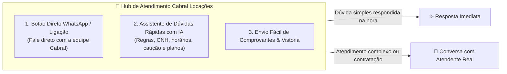
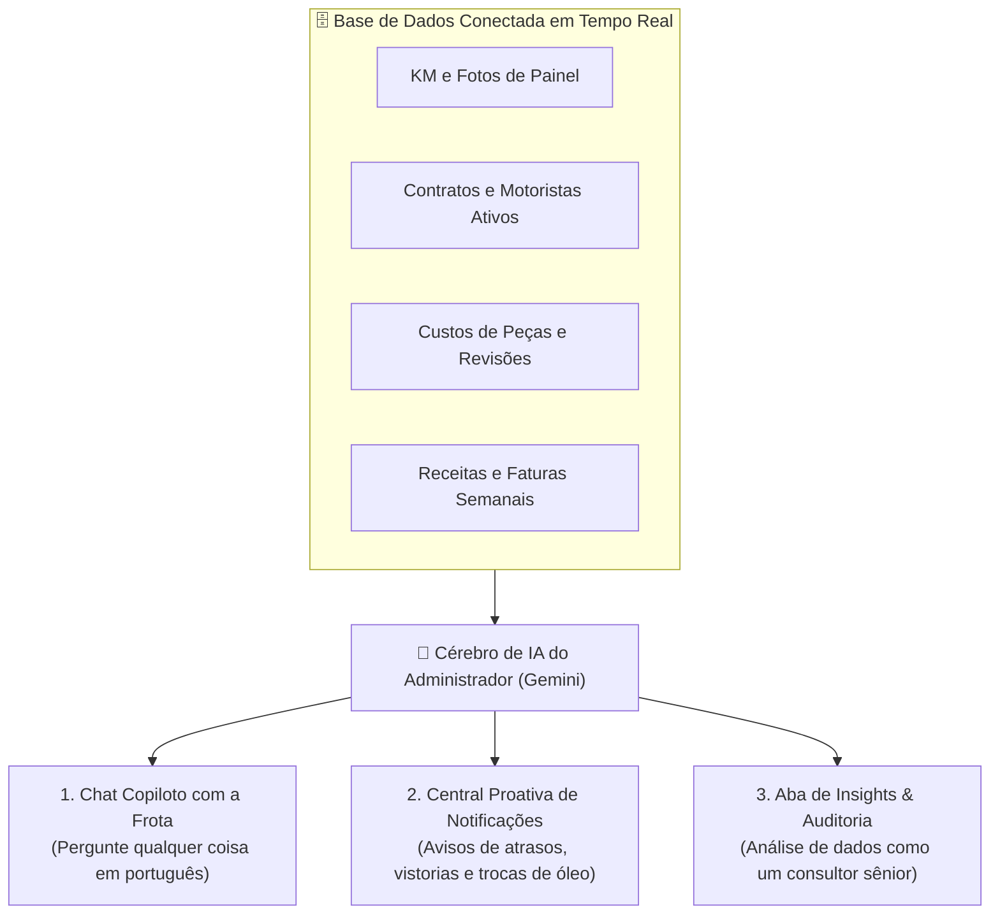

# 🚗 CABRAL LOCAÇÕES — PLANO MESTRE DO SAAS & GESTÃO DE FROTAS

Este documento consolida a arquitetura completa, modelo de negócios, inovações de alto ROI, dashboards operacionais e o ecossistema de inteligência artificial da **Cabral Locações**.

---

## 📑 Sumário

1. [Visão Geral do Negócio](#1-visão-geral-do-negócio)
2. [Experiência do Cliente & Hub de Atendimento Humanizado](#2-experiência-do-cliente--hub-de-atendimento-humanizado)
3. [Ecossistema de Inteligência Artificial do Administrador](#3-ecossistema-de-inteligência-artificial-do-administrador)
   - [Módulo A: Copiloto de Dados da Frota (Chat com Linguagem Natural)](#módulo-a-copiloto-de-dados-da-frota-chat-com-linguagem-natural)
   - [Módulo B: Central Proativa de Notificações & Alertas](#módulo-b-central-proativa-de-notificações--alertas)
   - [Módulo C: Painel de Insights & Auditoria Preditiva de Dados](#módulo-c-painel-de-insights--auditoria-preditiva-de-dados)
4. [Módulos dos Dashboards Operacionais & Financeiros](#4-módulos-dos-dashboards-operacionais--financeiros)
   - [Painel de Manutenção Preditiva por KM com Cotação Gamificada](#painel-de-manutenção-preditiva-por-km-com-cotação-gamificada)
   - [Dashboard Executivo com 10 KPIs](#dashboard-executivo-com-10-kpis)
   - [Análise de Rentabilidade da Frota (Exportação Excel/CSV)](#análise-de-rentabilidade-da-frota-exportação-excelcsv)
   - [Gestor Estável de Multas por OCR/PDF](#gestor-estável-de-multas-por-ocrpdf)
5. [Estratégia de Benchmarking & Site da Marca](#5-estratégia-de-benchmarking--site-da-marca)
6. [Arquitetura Tecnológica Recomendada](#6-arquitetura-tecnológica-recomendada)

---

## 1. Visão Geral do Negócio

* **Empresa**: Cabral Locações
* **Foco**: Locação ágil e sem burocracia para motoristas de aplicativo (Uber, 99, Indrive) e clientes convencionais.
* **Proposta de Valor**: Processo ágil (retirada expressa em 2 minutos), atendimento com suporte humanizado e controle financeiro e preventivo impecável nos bastidores.

---

## 2. Experiência do Cliente & Hub de Atendimento Humanizado



* **Hub de Contato Integrado no Site/App**:
  * Botão de 1 clique para chamar diretamente no número oficial da **Cabral Locações** no WhatsApp.
  * **IA de Apoio & Boas-Vindas**: Responde na hora dúvidas comuns (*"Quais documentos preciso?", "Qual valor da caução?", "Como funciona a manutenção?"*), tirando a sobrecarga da equipe e transferindo para o atendente humano quando o cliente quiser fechar o contrato.
* **Diferenciais Práticos do Cliente**:
  * **Retirada Express em 2 Minutos**: Cadastro e assinatura de contrato pelo celular antes de ir à loja.
  * **Caução Facilitada com Devolução via PIX no Ato da Devolução**.
  * **Clube do Bom Motorista**: Recompensas e descontos para quem cuida do carro e paga em dia.

---

## 3. Ecossistema de Inteligência Artificial do Administrador

Uma IA conectada em tempo real a todas as tabelas do banco de dados (Carros, Placas, KM, Contratos, Custos, Receitas e Manutenções):



### Módulo A: Copiloto de Dados da Frota (Chat em Linguagem Natural)
O administrador pode abrir o chat no painel e fazer perguntas diretas:
* > *"Quais carros estão alugados hoje e quem são os motoristas?"*
  * **Resposta da IA**: Lista todos os veículos na rua com nome do motorista, placa, data de vencimento da semana e valor da semanalidade.
* > *"Qual é a quilometragem atual do HB20 placa ABC-1234?"*
  * **Resposta da IA**: *"O HB20 ABC-1234 está com **48.210 km** (atualizado ontem). A última troca de óleo foi aos 40.000 km e faltam **1.790 km** para a próxima revisão."*
* > *"Quanto faturamos nesta semana até agora?"*
  * **Resposta da IA**: *"Faturamento acumulado da semana: **R$ 3.850,00** (7 faturas pagas, 2 a vencer hoje)."*

---

### Módulo B: Central Proativa de Notificações & Alertas Inteligentes
A IA roda verificações automáticas e envia alertas no topo do painel:
* ⚠️ **Alerta de Vistoria Semanal**: *"O motorista Carlos (Cronos XYZ-9876) não envia a foto semanal do painel há 8 dias."*
* ⏰ **Alerta de Vencimento**: *"3 faturas semanais de motoristas de Uber vencem hoje (Total: R$ 1.650,00)."*
* 🛢️ **Alerta Crítico de Manutenção**: *"O Fiat Argo ABC-1234 atingiu a faixa vermelha de troca de óleo (faltam apenas 150 km)."*
* 🏆 **Alerta de Fidelidade**: *"O motorista Marcos completou 6 meses de contrato sem atrasos nem multas (Elegível a desconto de fidelidade)."*

---

### Módulo C: Aba de Insights & Auditoria Preditiva de Dados (Analista de Dados IA)
Uma aba exclusiva no Dashboard que realiza uma **auditoria profunda e contínua** em todos os indicadores da locadora:

```
┌────────────────────────────────────────────────────────────────────────────────────────┐
│ 🧠 INSIGHTS & AUDITORIA PREDITIVA COM IA — CABRAL LOCAÇÕES                              │
├────────────────────────────────────────────────────────────────────────────────────────┤
│ 💡 INSIGHT 1: DESGASTE ACELERADO DE KM (ALERTA DE PREVENÇÃO)                           │
│  • O motorista Felipe (HB20 - ABC-1234) está rodando uma média de 240 km/dia (35%     │
│    acima da média da frota de 175 km/dia).                                             │
│  ➔ Recomendação da IA: A revisão de 30.000 km ocorrerá 18 dias antes do previsto.     │
│    Antecipe a compra do kit de óleo para aproveitar a cotação em lote.                 │
├────────────────────────────────────────────────────────────────────────────────────────┤
│ 💡 INSIGHT 2: MARGEM REAL DE LUCRO POR MODELO DE VEÍCULO                               │
│  • O Fiat Cronos apresentou margem de lucro líquido de 89.2% este mês.                 │
│  • O Renault Kwid apresentou margem de 64.1% devido a 2 trocas de pastilhas de freio. │
│  ➔ Recomendação da IA: Na próxima renovação de frota, priorize modelos da linha Cronos │
│    ou Onix Plus, que apresentam menor custo de manutenção por KM rodado na Uber.       │
├────────────────────────────────────────────────────────────────────────────────────────┤
│ 💡 INSIGHT 3: PREDIÇÃO DE REVISÕES CONCORRENTES                                        │
│  • 4 veículos da frota atingirão múltiplos de 10.000 km na primeira quinzena de Out.   │
│  ➔ Recomendação da IA: Escalone os agendamentos nas oficinas parceiras para não ficar  │
│    com mais de 1 carro parado na mesma data.                                           │
└────────────────────────────────────────────────────────────────────────────────────────┘
```

---

## 4. Módulos dos Dashboards Operacionais & Financeiros

1. **Painel de Manutenção Preditiva por KM (Imagem 1)**: Cards com contagem regressiva (`X.XXX km para o vencimento`) e barras percentuais coloridas.
2. **Cotação de Peças com IA Gamificada**: A IA lista as peças necessárias, o administrador só digita os preços cotados e gera a ordem de compra em PDF.
3. **Dashboard Executivo com 10 KPIs (Imagem 2)**: Indicadores de Troca de Óleo, Vistorias, Locações Ativas, Veículos Disponíveis, Investido, A Vencer, Recebidos, Em Atraso e Multas.
4. **Tabela de Rentabilidade por Veículo**: Com botões de exportação em **Excel (.xlsx)**, **CSV (.csv)** e **PDF**.
5. **Gestor de Multas por OCR/PDF**: Leitura automática de autos de infração e vínculo imediato ao motorista.

---

## 5. Estratégia de Benchmarking & Site da Marca

* **Estrutura Inspirada em**: Kovi / Zarp Localiza (foco em planos semanais) e Turbi (tecnologia limpa).
* **Identidade Visual Cabral Locações**: Azul Marinho (`#0F172A`), Verde Esmeralda (`#10B981`), tipografia moderna e fotos reais dos carros.
