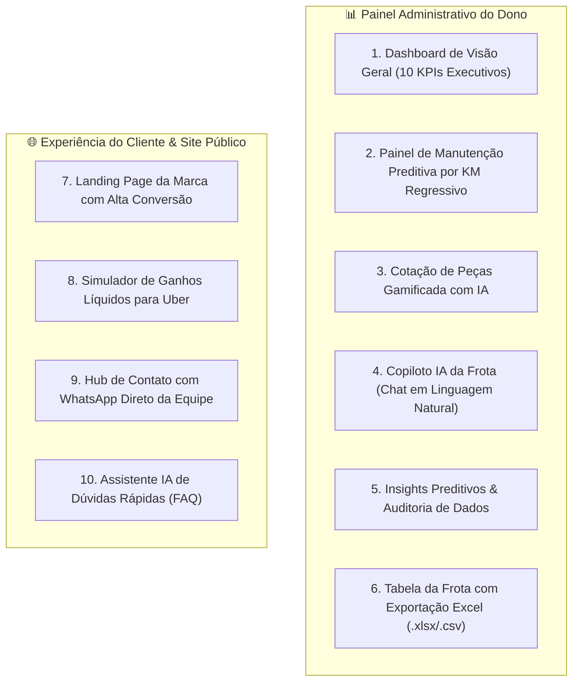

# 🚗 Cabral Locações — SaaS de Gestão de Frotas & Locação para Motoristas de App

<p align="center">
  
</p>

<p align="center">
  <a href="#-sobre-o-projeto"></a>
  <a href="#-stack-tecnológica"></a>
  <a href="#-inteligência-artificial"></a>
  <a href="#-banco-de-dados"></a>
</p>

---

## 📖 1. Sobre o Projeto

O **Cabral Locações SaaS** é uma plataforma completa e moderna desenvolvida sob medida para a operação profissional de locação de frotas com foco estratégico em **motoristas de aplicativo (Uber, 99 e Indrive)** e locações comerciais/turismo.

O sistema elimina 100% de pranchetas de papel, anotações soltas e planilhas desorganizadas, trazendo automação de manutenção por quilometragem, leitura de painel, copiloto de inteligência artificial e controle financeiro em tempo real.

---

## 🌟 2. Principais Módulos & Recursos



### 🛢️ A. Manutenção Preditiva com KM Regressivo (Referência de Operação)
* Alertas automáticos por quilometragem para: *Troca de Óleo, Filtros, Alinhamento, Rodízio de Pneus, Pastilhas de Freio e Revisão Geral*.
* Cards visuais com contagem regressiva (`X.XXX km para o vencimento`) e barras percentuais coloridas (Verde / Amarelo / Vermelho Urgente).
* **Cotação Gamificada com IA**: A IA lista as peças dos carros que precisam de revisão; o administrador apenas digita os preços unitários cotados e gera a ordem de compra em PDF / WhatsApp em 1 clique.

### 📊 B. Visão Geral com 10 KPIs Executivos
1. 🛢️ **Troca de Óleo** (Laranja)
2. 📋 **Vistorias Pendentes** (Verde Água)
3. 📝 **Locações Ativas** (Azul)
4. 🚗 **Veículos Disponíveis** (Verde)
5. 🔑 **Em Locação** (Roxo)
6. 💵 **Total Investido na Frota** (Roxo Escuro)
7. ⏰ **A Vencer na Semana** (Amarelo)
8. ✅ **Recebidos no Mês** (Verde)
9. 🚨 **Em Atraso** (Vermelho)
10. 🎟️ **Multas a Repassar** (Marrom)
* **Calendário Financeiro da Semana**: Linha do tempo das faturas semanais dos motoristas.

### 🧠 C. Copiloto de IA & Auditoria Preditiva de Dados
* **Chat com a Frota**: Pergunte qualquer coisa em português (*"Quais carros estão alugados hoje?", "Qual o KM do HB20?", "Quanto faturamos nesta semana?"*) e receba respostas instantâneas.
* **Insights Preditivos**: Análise de desgaste acelerado de KM por motorista, auditoria de margem de lucro real por modelo de carro e prevenção de gargalos em oficinas mecânicas.

### 🌐 D. Site Público com Simulador de Ganhos Uber
* Catálogo de veículos com fotos e especificações.
* **Simulador Interativo**: O motorista calcula seus ganhos líquidos mensais de acordo com as horas rodadas por dia.
* **Hub de Atendimento Humanizado**: Conexão direta com o WhatsApp oficial da Cabral Locações sem robôs de 0800.

---

## 📁 3. Estrutura do Repositório

```
Cabral-Locacoes/
├── 📄 README.md                            # Documentação principal para o GitHub
├── 📄 PLANO_MESTRE_CABRAL_LOCACOES.md      # Arquitetura completa e modelo de negócio
├── 📄 01_ARQUITETURA_E_DASHBOARDS.md       # Especificação técnica dos componentes
├── 📄 02_REFERENCIAS_VISUAIS_E_SITE.md     # Guia de identidade visual e benchmarking
├── 📁 prompts/                             # Suíte de Prompts para Opus 5.0 / 4.8
│   ├── 📜 01_SETUP_BANCO_E_TYPES.md
│   ├── 📜 02_DASHBOARD_10KPIS_E_CALENDARIO.md
│   ├── 📜 03_MANUTENCAO_PREDITIVA_E_COTACAO.md
│   ├── 📜 04_COPILOTO_IA_E_EXPORTACAO_EXCEL.md
│   └── 📜 05_SITE_PUBLICO_CABRAL_LOCACOES.md
└── 📁 src/                                 # Código-Fonte da Aplicação
    ├── 📄 App.tsx                          # Aplicação unificada com navegação por abas
    ├── 📁 types/
    │   └── 📄 fleet.ts                     # Interfaces TypeScript estritas
    ├── 📁 lib/
    │   ├── 📄 mock-data.ts                 # Dados realistas da frota e contratos
    │   └── 📁 utils/
    │       ├── 📄 calculations.ts          # Cálculos de KM regressivo e moedas
    │       └── 📄 export.ts                # Exportador nativo de CSV / Excel
    └── 📁 components/
        ├── 📄 Navbar.tsx                   # Barra de navegação com gatilho do WhatsApp
        ├── 📄 DashboardOverview.tsx        # Tela de 10 KPIs e Calendário
        ├── 📄 MaintenanceDashboard.tsx     # Painel de KM e Cotação IA Gamificada
        ├── 📄 AiCopilotAndInsights.tsx     # Chat Copiloto e Insights de Auditoria
        ├── 📄 FleetTableWithExport.tsx     # Tabela com busca e exportação CSV
        ├── 📄 PublicLandingPage.tsx        # Landing Page pública e Simulador Uber
        └── 📄 ContactHubModal.tsx          # Modal de Contato Humanizado e FAQ
```

---

## 🛠️ 4. Stack Tecnológica

* **Frontend**: Next.js 14+ (App Router), React 18, Tailwind CSS, Lucide Icons.
* **Tipagem & Qualidade**: TypeScript Estrito (Zero `any`).
* **Banco de Dados & Storage**: Supabase (PostgreSQL em tempo real + Storage para fotos de vistoria).
* **Inteligência Artificial**: Google Gemini 2.0 Flash (Free Tier / Verdent AI com Opus 5.0 / 4.8).
* **Deploy**: Vercel ou Netlify.

---

## 🚀 5. Como Rodar o Projeto Localmente

### Pré-requisitos:
* Node.js 18+ instalado.
* NPM ou Yarn.

### Passo a Passo:
```bash
# 1. Clone o repositório
git clone https://github.com/SEU_USUARIO/cabral-locacoes.git
cd cabral-locacoes

# 2. Instale as dependências
npm install

# 3. Inicie o servidor de desenvolvimento
npm run dev
```

Abra [http://localhost:3000](http://localhost:3000) no seu navegador para ver a aplicação rodando.

---

## 🔒 6. Segurança e Conformidade (LGPD)

O projeto foi auditado contra as diretrizes **OWASP Top 10** e boas práticas de desenvolvimento:
* Zero chaves expostas no frontend.
* Sanitização completa contra XSS e Injection.
* Dados de clientes e motoristas protegidos em conformidade com a LGPD.

---

<p align="center">
  <b>Cabral Locações de Veículos LTDA</b> · Todos os direitos reservados.
</p>
